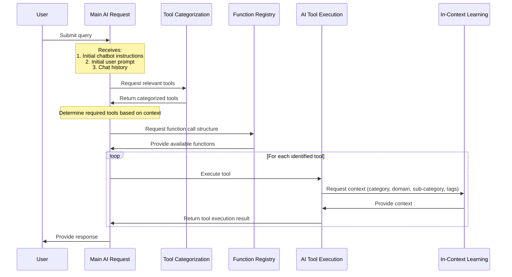

# Masterbots Ai Tooling Function Call System v0a

## Masterbots Ai Tooling Function Call System Glossary

### User

- **Technical**: The end-user of the system who interacts with the frontend interface.
- **Product**: The person using the Masterbots platform to get AI-assisted responses to their queries.

### Main AI Request

- **Technical**: The primary AI model that receives initial inputs, manages the overall conversation flow, and coordinates tool execution.
- **Product**: The central "brain" of Masterbots that understands user requests and orchestrates the appropriate responses.

### Initial Chatbot Instructions

- **Technical**: Predefined guidelines and parameters set for each chatbot to define its behavior and capabilities.
- **Product**: The personality and knowledge base of each AI assistant, tailoring its responses to specific use cases or domains.

### Tool Categorization

- **Technical**: A system component that organizes and classifies available AI tools based on various attributes like category, domain, and tags.
- **Product**: A smart catalog of AI capabilities, ensuring that the most relevant tools are used for each user query.

### Function Registry

- **Technical**: A repository of available functions that can be called by the Main AI, including their specifications and requirements.
- **Product**: The toolbox of AI capabilities that Masterbots can use to solve user problems or answer questions.

### AI Tool Execution

- **Technical**: The process of running a specific AI function or model to perform a task or generate a response.
- **Product**: The action of using a specialized AI capability to address a specific part of the user's request.

### In-Context Learning (ICL)

- **Technical**: A system that provides relevant contextual information to improve the accuracy and relevance of AI tool outputs.
- **Product**: A smart memory system that helps AI tools understand the specific context of each user request, leading to more accurate and helpful responses.

### WordWare Functions

- **Technical**: A set of predefined functions with specific structures (id, params, label) used for executing AI tools.
- **Product**: Specialized AI capabilities that can be called upon to perform specific tasks within a user's request.

### MBPrompts Functions

- **Technical**: Another set of functions (with id, label, params) used for executing specific AI prompts or tasks.
- **Product**: Pre-designed AI interactions that help guide the conversation or perform common tasks efficiently.

### Language Processor

- **Technical**: A component that enhances user input and handles translation between the user's language and English.
- **Product**: A smart language assistant that ensures clear communication between the user and the AI, regardless of the user's native language.

### Function Call Structure

- **Technical**: The format and protocol used for invoking AI tools and functions within the system.
- **Product**: The seamless way Masterbots combines different AI capabilities to solve complex user requests.

### Category, Domain, Sub-category, and Tags

- **Technical**: Metadata used to classify and organize AI tools and functions for more accurate selection and execution.
- **Product**: Smart labels that help Masterbots understand the context of user requests and choose the most appropriate AI capabilities.

### Chat History

- **Technical**: A record of previous interactions within a conversation, used to maintain context and continuity.
- **Product**: The AI's memory of the ongoing conversation, allowing for more natural and context-aware responses.
